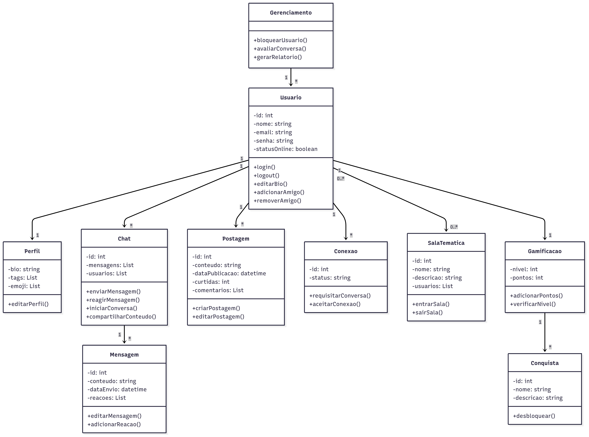

# Diagrama de Classe

## Introdução

O diagrama de classes é uma das principais ferramentas da UML e desempenha um papel essencial na etapa de modelagem de sistemas, permitindo representar de forma visual e organizada, os elementos estruturais de um software, destacando classes, atributos, métodos e os relacionamentos que se estabelecem entre eles. No contexto deste projeto, a elaboração do diagrama foi fundamental para compreender e estruturar as funcionalidades relacionadas à interação entre usuários, gerenciamento de perfis, trocas de mensagens e recursos sociais, como amizades e compartilhamentos.  

## Objetivo/Metodologia

O principal objetivo deste diagrama é oferecer uma visão clara e abrangente da arquitetura conceitual do sistema que está sendo desenvolvido, evidenciando suas principais entidades e suas interações. Através dele, buscamos representar os elementos essenciais do sistema de forma padronizada, destacando funcionalidades como login, gerenciamento de perfil, postagens, salas temáticas, conexões e interações no chat, incluindo também recursos complementares que surgiram nas discussões do grupo, como a avaliação de conversas, o compartilhamento de conteúdos em chats e a possibilidade de adicionar ou remover amizades.  

A construção do diagrama seguiu uma abordagem colaborativa, apoiada nas etapas de teoria e levantamento de requisitos. Inicialmente, foram analisados os conceitos chave do sistema com base em brainstorming e rich pictures desenvolvidos pelo grupo. Em seguida, identificaram-se as principais entidades e suas respectivas responsabilidades. A modelagem foi conduzida utilizando a notação do Mermaid, que possibilitou a criação de um diagrama textual, versionável e de fácil manutenção.  

## Desenvolvimento

**Figura 1:** Diagrama de Classes  

  

**Autores:** [João Pedro Costa](https://github.com/johnaopedro) e [Julia Gabriela](https://github.com/JuliaGabP).  

## Especificação Estendida do Diagrama de Classe

### 1. **Classe `Usuário`**

- **Atributos**
  - `id: int`
  - `nome: string`
  - `email: string`
  - `senha: string`
  - `statusOnline: boolean`

- **Métodos**
  - `+ login(): void`
  - `+ logout(): void`
  - `+ editarBio(): void`
  - `+ adicionarAmigo(): void`
  - `+ removerAmigo(): void`

- **Relacionamentos**
  - Associação 1:1 com **Perfil**
  - Associação 1:N com **Chat**
  - Composição 1:N com **Postagem**
  - Associação 1:N com **Conexão**
  - Associação N:M com **SalaTematica**
  - Associação 1:1 com **Gamificação**

---

### 2. **Classe `Perfil`**

- **Atributos**
  - `bio: string`
  - `tags: List`
  - `emoji: List`

- **Métodos**
  - `+ editarPerfil(): void`

- **Relacionamentos**
  - Associação 1:1 com **Usuário**

---

### 3. **Classe `Chat`**

- **Atributos**
  - `id: int`
  - `mensagens: List`
  - `usuarios: List`

- **Métodos**
  - `+ enviarMensagem(): void`
  - `+ reagirMensagem(): void`
  - `+ iniciarConversa(): void`
  - `+ compartilharConteudo(): void`

- **Relacionamentos**
  - Associação N:M com **Usuário**
  - Composição 1:N com **Mensagem**

---

### 4. **Classe `Mensagem`**

- **Atributos**
  - `id: int`
  - `conteudo: string`
  - `dataEnvio: datetime`
  - `reacoes: List`

- **Métodos**
  - `+ editarMensagem(): void`
  - `+ adicionarReacao(): void`

- **Relacionamentos**
  - Composição 1:N com **Chat**

---

### 5. **Classe `Postagem`**

- **Atributos**
  - `id: int`
  - `conteudo: string`
  - `dataPublicacao: datetime`
  - `curtidas: int`
  - `comentarios: List`

- **Métodos**
  - `+ criarPostagem(): void`
  - `+ editarPostagem(): void`

- **Relacionamentos**
  - Composição 1:N com **Usuário**

---

### 6. **Classe `Conexão`**

- **Atributos**
  - `id: int`
  - `status: string`

- **Métodos**
  - `+ requisitarConversa(): void`
  - `+ aceitarConexao(): void`

- **Relacionamentos**
  - Associação 1:N com **Usuário**

---

### 7. **Classe `SalaTematica`**

- **Atributos**
  - `id: int`
  - `nome: string`
  - `descricao: string`
  - `usuarios: List`

- **Métodos**
  - `+ entrarSala(): void`
  - `+ sairSala(): void`

- **Relacionamentos**
  - Associação N:M com **Usuário**

---

### 8. **Classe `Gamificação`**

- **Atributos**
  - `nivel: int`
  - `pontos: int`

- **Métodos**
  - `+ adicionarPontos(): void`
  - `+ verificarNivel(): void`

- **Relacionamentos**
  - Associação 1:1 com **Usuário**
  - Composição 1:N com **Conquista**

---

### 9. **Classe `Conquista`**

- **Atributos**
  - `id: int`
  - `nome: string`
  - `descricao: string`

- **Métodos**
  - `+ desbloquear(): void`

- **Relacionamentos**
  - Composição 1:N com **Gamificação**

---

### 10. **Classe de Controle `Gerenciamento`**

- **Métodos**
  - `+ bloquearUsuario(): void`
  - `+ avaliarConversa(): void`
  - `+ gerarRelatorio(): void`

- **Relacionamentos**
  - Associação 1:N com **Usuário**

---

## Resumo dos Relacionamentos

| **Entidade**     | **Entidade**     | **Relacionamento** | **Cardinalidade** | **Descrição** |
|------------------|------------------|--------------------|-------------------|---------------|
| Usuário          | Perfil           | Associação         | 1:1               | Cada usuário possui um perfil |
| Usuário          | Chat             | Associação         | 1:N               | Um usuário participa de vários chats |
| Chat             | Mensagem         | Composição         | 1:N               | Um chat contém várias mensagens |
| Usuário          | Postagem         | Composição         | 1:N               | Um usuário pode criar várias postagens |
| Usuário          | Conexão          | Associação         | 1:N               | Um usuário pode ter várias conexões |
| Usuário          | SalaTematica     | Associação         | N:M               | Usuários participam de várias salas |
| Usuário          | Gamificação      | Associação         | 1:1               | Cada usuário possui um sistema de gamificação |
| Gamificação      | Conquista        | Composição         | 1:N               | A gamificação gera conquistas desbloqueáveis |
| Gerenciamento    | Usuário          | Associação         | 1:N               | Gerenciamento pode aplicar ações a usuários |

---

## Bibliografia  

Conjunto de obras consultadas.  

> Criar um diagrama de classe UML - Suporte da Microsoft. Disponível em: <https://support.microsoft.com/pt-br/topic/criar-um-diagrama-de-classe-uml-de6be927-8a7b-4a79-ae63-90da8f1a8a6b>.  

## Histórico de Versões

| Versão |     Data    | Descrição   | Autor(es) | Revisor(es) | Detalhes da revisão | 
| ------ | ----------- | ----------- | --------- | ----------- | --------------------|
| `1.0`  | 09/09/2025  | Criação do documento | [Julia Gabriela](https://github.com/JuliaGabP) | [João Pedro Costa](https://github.com/johnaopedro) | O diagrama estava com um pedaço na imagem cortado |
| `1.1`  | 09/09/2025  | Criação do diagrama | [João Pedro Costa](https://github.com/johnaopedro) e [Julia Gabriela](https://github.com/JuliaGabP) | - | - |
| `1.2`  | 10/09/2025  | Inclusão da especificação estendida | [João Pedro Costa](https://github.com/johnaopedro) e [Julia Gabriela](https://github.com/JuliaGabP) | - | - |
