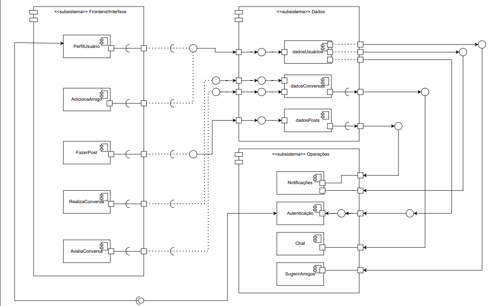
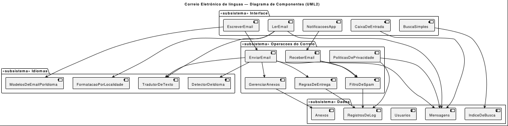

# Diagrama de Componentes

## Introdução
O diagrama de componentes é uma notação UML que representa a arquitetura do sistema a partir de blocos de alto nível (componentes) e suas dependências. No projeto **Correio Digital**, este artefato permite visualizar como a aplicação está dividida em **camadas** (Interface, Operações e Dados), destacando os principais serviços do sistema e os repositórios de informação.  

Este diagrama é especialmente útil para comunicar a organização modular do sistema entre os membros da equipe, favorecendo a manutenção e evolução do software.

## Objetivo/Metodologia
O objetivo do diagrama de componentes é apresentar de forma clara como os **módulos do sistema** se relacionam. A metodologia seguiu estas etapas:  
- **Identificação de subsistemas**: agrupados em *Frontend/Interface*, *Operações* e *Dados*.  
- **Definição dos componentes**: funcionalidades principais foram alocadas em seus pacotes.  
- **Modelagem visual**: utilização de notação UML padronizada para representar os pacotes e componentes.  
- **Validação em grupo**: conferência entre os autores para garantir consistência com os requisitos do sistema.

## Desenvolvimento

**Figura 1:** Diagrama de Componentes  

  

**Autores:**[Túlio Celeri](https://github.com/TulioCeleri)
---

**Figura 2:** Diagrama de Componentes v2  

  

**Autores:** [Thales Germano](https://github.com/thalesgvl)

---

## Especificação dos Pacotes e Componentes

### Pacote **Frontend/Interface**
- **FazerPost**: Permite ao usuário criar novas postagens e encaminhar o conteúdo para o backend.  

### Pacote **Operações**
- **Notificações**: Responsável por avisar o usuário sobre novos eventos, como mensagens ou reações.  
- **Autenticação**: Realiza login e logout, garantindo acesso seguro ao sistema.  
- **RealizaConversa**: Gerencia o fluxo de uma conversa entre usuários.  
- **AvaliaConversa**: Implementa a lógica de avaliação de conversas (feedback, gamificação).  
- **Chat**: Gerencia a infraestrutura das conversas em tempo real.  
- **SugerirAmigos**: Oferece recomendações de novas conexões.  
- **AdicionaAmigo**: Gerencia o processo de envio e confirmação de solicitações de amizade.  
- **PerfilUsuário**: Disponibiliza funções de visualização e edição do perfil do usuário.  

### Pacote **Dados**
- **dadosUsuários**: Repositório de informações cadastrais e perfis.  
- **dadosConversas**: Repositório de mensagens e históricos de conversas.  
- **dadosPosts**: Repositório de postagens criadas e compartilhadas.  

---

## Relações Principais (Resumo)

| Origem             | Destino        | Descrição                                       |
|--------------------|---------------|-------------------------------------------------|
| FazerPost          | dadosPosts    | Criação e persistência de novas postagens.      |
| Chat / RealizaConversa | dadosConversas | Armazena histórico das conversas.           |
| PerfilUsuário      | dadosUsuários | Consulta e atualização de informações.          |
| Autenticação       | dadosUsuários | Validação de credenciais e sessões.             |
| AvaliaConversa     | dadosConversas | Usa dados de conversas para avaliação.          |
| SugerirAmigos      | dadosUsuários | Sugestões com base no histórico do usuário.     |
| AdicionaAmigo      | dadosUsuários | Persistência de novas amizades.                 |
| Notificações       | dadosUsuários | Emite alertas direcionados ao usuário.          |

---

## Bibliografia  

> VideoAula - DSW-Modelagem - Componentes, Milene Serrano, 2020. Disponível em: <https://unbbr-my.sharepoint.com/personal/mileneserrano_unb_br/_layouts/15/stream.aspx?id=%2Fpersonal%2Fmileneserrano%5Funb%5Fbr%2FDocuments%2FArqDSW%20%2D%20V%C3%ADdeosOriginais%2F05h%20%2D%20VideoAula%20%2D%20DSW%2DModelagem%20%2D%20Componentes%2Emp4&ga=1&referrer=StreamWebApp%2EWeb&referrerScenario=AddressBarCopied%2Eview%2E49271658%2D8f5a%2D4195%2D846c%2Df266664b46e1>

## Histórico de Versões

| Versão | Data       | Descrição  | Autor(es) | Revisor(es) | Detalhes |
|--------|-----------|-----------------------------|-----------|-------------|----------|
| `1.0`  | 15/09/2025 | Criação inicial do documento |[Thales Germano](https://github.com/thalesgvl) |  [Julia Gabriela](https://github.com/JuliaGabP) | Estrutura inicial |