# Diagrama de Atividades

## Introdução

O **Diagrama de Atividades** é um dos diagramas da **UML (Unified Modeling Language)** utilizado para representar o **fluxo de atividades** dentro de um processo ou sistema.  
Ele mostra **ações, decisões, paralelismos e fluxos de controle**, permitindo visualizar **como o trabalho é executado** desde o início até a conclusão.  

Esse tipo de diagrama é especialmente útil para:  
- **Modelar processos de negócio e rotinas organizacionais**;  
- **Descrever o comportamento de casos de uso**;  
- **Representar algoritmos ou fluxos de sistema**;  
- **Identificar pontos de decisão e atividades paralelas**.  

Em resumo, o diagrama de atividades ajuda a compreender **o passo a passo das ações** e facilita a comunicação entre desenvolvedores, analistas e usuários, já que apresenta de forma **visual e intuitiva** a lógica do processo.

## Metodologia

Dois membros foram responsáveis pela elaboração dos diagramas de atividade, desenvolvidos no [draw.io](https://www.drawio.com/). 

Para elaborar um Diagrama de Atividades, utiliza-se um conjunto de símbolos específicos que representam diferentes aspectos do fluxo. Esses símbolos incluem elementos destinados a iniciar, encerrar, fundir ou receber etapas dentro do processo.
A tabela a seguir apresenta os principais elementos da UML aplicados nos diagramas de atividade, juntamente com seus símbolos, nomes e descrições.

| Símbolo                            | Nome                   | Descrição                                                                                                                                                                    |
|------------------------------------|------------------------|------------------------------------------------------------------------------------------------------------------------------------------------------------------------------|
| 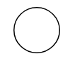  | Nodo Inicial           | Representa o ponto de início do fluxo de atividades. É simbolizado por um círculo branco                                                                       |
| 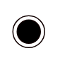        | Nodo Final             | Indica o término do fluxo de atividades. É representado por um círculo preenchido em preto dentro de outro círculo.                                                          |
| 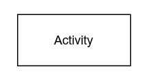 | Atividade              | Representa uma tarefa ou ação específica no fluxo. É simbolizada por um retângulo que contêm a descrição da tarefa.                                      |
| 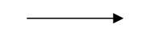   | Conector      | Mostra o fluxo de direção, ou fluxo de controle, da atividade. |
| 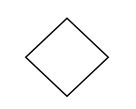     | Nodo de Decisão        | Indica um ponto de decisão no fluxo onde diferentes caminhos podem ser tomados. É representado por um losango.                                                               |
|           | Barra de Sincronização | Indica um ponto do processo em que o fluxo pode ser dividido em atividades paralelas (fork) ou reunido em um único caminho (join). É simbolizada por uma barra preta horizontal.                 |
| 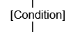   | Texto de Condição      | Representa a condição que determina qual caminho o fluxo deve seguir quando encontra um ponto de decisão. É escrito na linha que sai do losango de decisão. |

## Diagramas de Atividades das Páginas do Site

### SignUp e Login

**Figura 1:** Diagrama de Atividade de SignUp e LogIn

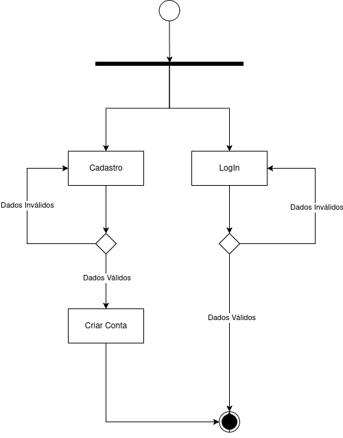

**Autores:** [Pedro Ferreira Gondim](https://github.com/G0ndim) e [Túlio Augusto Celeri](https://github.com/TulioCeleri).

### Chat

**Figura 2:** Diagrama de Atividade do Chat

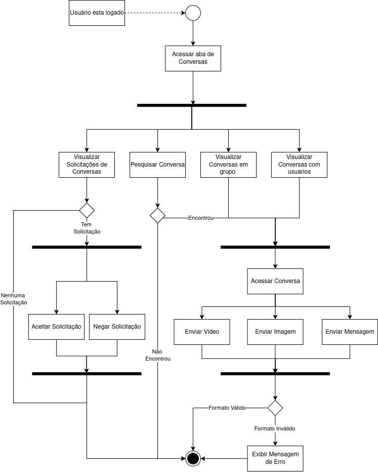

**Autores:** [Pedro Ferreira Gondim](https://github.com/G0ndim) e [Túlio Augusto Celeri](https://github.com/TulioCeleri).

### Perfil de Usuário

**Figura 3:** Diagrama de Atividade do Perfil de Usuário

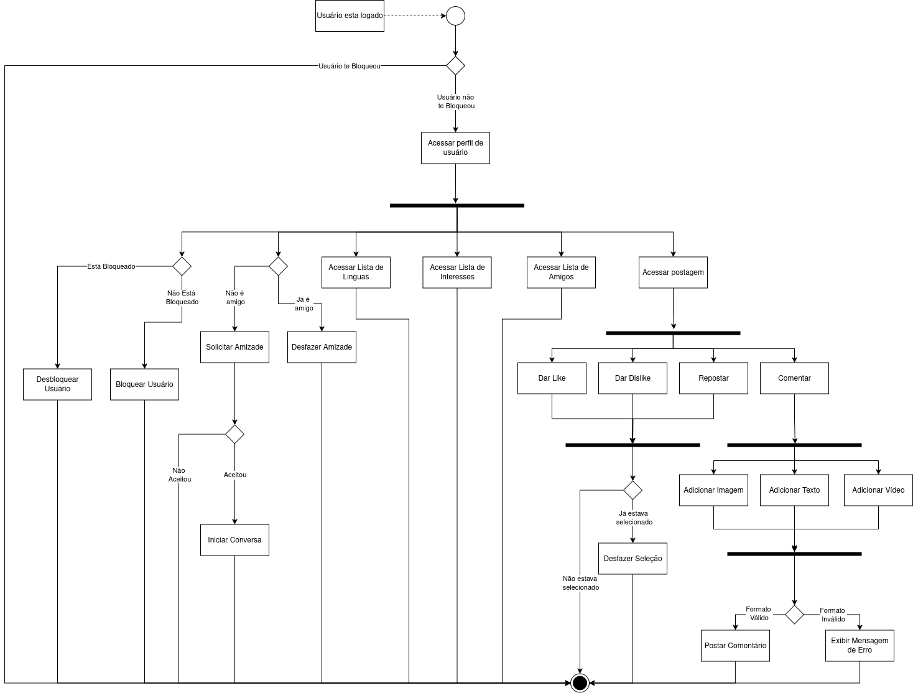

**Autores:** [Pedro Ferreira Gondim](https://github.com/G0ndim) e [Túlio Augusto Celeri](https://github.com/TulioCeleri).

### Perfil do Próprio Usuário

**Figura 4:** Diagrama de Atividade do Perfil do Próprio Usuário

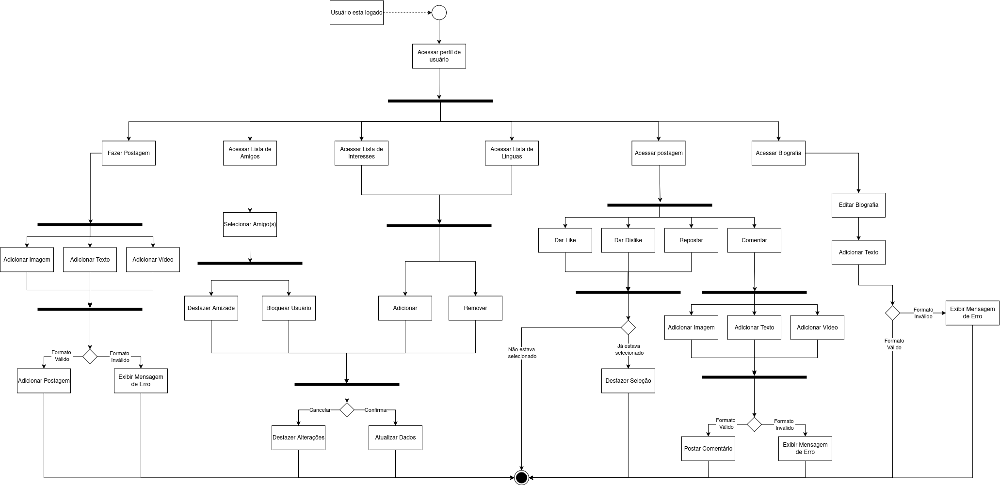

**Autores:** [Pedro Ferreira Gondim](https://github.com/G0ndim) e [Túlio Augusto Celeri](https://github.com/TulioCeleri).

### Explorar

**Figura 5:** Diagrama de Atividade da aba Explorar

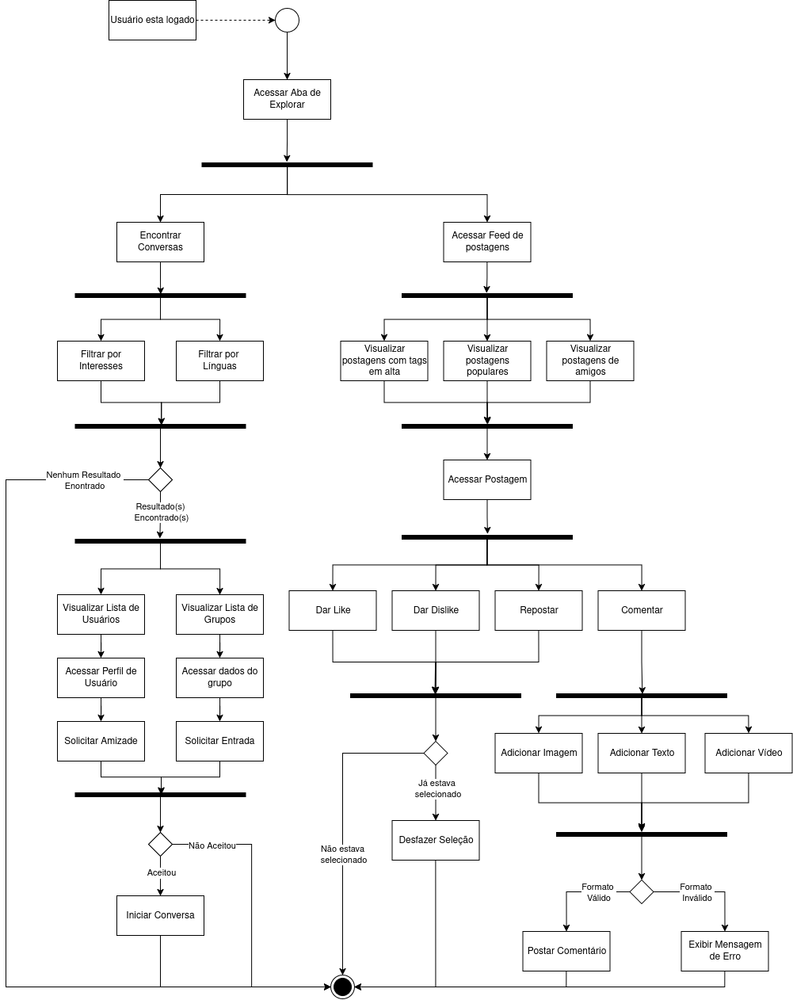

**Autores:** [Pedro Ferreira Gondim](https://github.com/G0ndim) e [Túlio Augusto Celeri](https://github.com/TulioCeleri).

## Referências Bibliográficas

>1.  BÓSON TREINAMENTOS. **O que é um Diagrama de Atividade UML - Introdução**. YouTube, 2022. Disponível em: <https://www.youtube.com/watch?v=_1vHj_j3zDY>. Acesso em: 15 de setembro de 2025. 

>2.  Milene Serrano. **06c - VideoAula - DSW-Modelagem - Atividades**. Sharepoint, 2020. Disponível em: <https://unbbr-my.sharepoint.com/:v:/g/personal/mileneserrano_unb_br/Ed9k-OvMH7hMlNMj6CGVenMBSyeVrDBOdg84Czx_aHI9gw?e=78GaZi&nav=eyJyZWZlcnJhbEluZm8iOnsicmVmZXJyYWxBcHAiOiJTdHJlYW1XZWJBcHAiLCJyZWZlcnJhbFZpZXciOiJTaGFyZURpYWxvZy1MaW5rIiwicmVmZXJyYWxBcHBQbGF0Zm9ybSI6IldlYiIsInJlZmVycmFsTW9kZSI6InZpZXcifX0%3D>. Acesso em: 15 de setembro de 2025. 

## Histórico de Versões

| Versão |     Data    | Descrição   | Autor(es) | Revisor(es) | Detalhes da revisão | 
| ------ | ----------- | ----------- | --------- | ----------- | --------------------|
| `1.0` | 15/09/2025 | Criação esqueleto do documento | [Pedro Ferreira Gondim](https://github.com/G0ndim) | [Túlio Augusto Celeri](https://github.com/TulioCeleri) | O esqueleto do documento foi criado corretamente |
| `1.1` | 15/09/2025 | Adição dos diagramas de atividades | [Pedro Ferreira Gondim](https://github.com/G0ndim) e [Túlio Augusto Celeri](https://github.com/TulioCeleri) | - | - |
| `1.2` | 15/09/2025 | Adição da introdução e metodologia | [Pedro Ferreira Gondim](https://github.com/G0ndim) e [Túlio Augusto Celeri](https://github.com/TulioCeleri) | - | - |
| `1.3` | 16/09/2025 | Alterações na Introdução | [Pedro Ferreira Gondim](https://github.com/G0ndim) e [Túlio Augusto Celeri](https://github.com/TulioCeleri) | - | - |