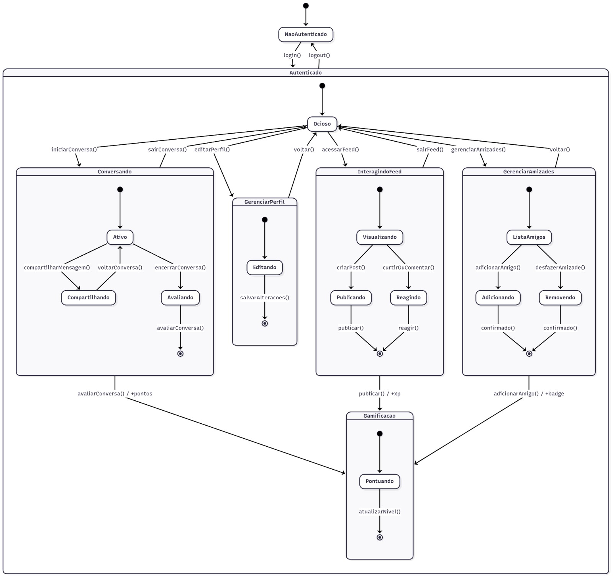

# Diagrama de Estados

## Introdução
O Diagrama de Estados é uma ferramenta fundamental da modelagem de sistemas, utilizada para representar o ciclo de vida dos objetos, descrevendo os estados possíveis em que eles podem se encontrar e os eventos que provocam mudanças entre esses estados. No contexto deste projeto, voltado para o desenvolvimento de um sistema de um Correio Digital, o diagrama auxilia na visualização das transições que os usuários podem realizar durante sua interação com o aplicativo, como iniciar conversas, gerenciar amizades, interagir com o feed e personalizar seus perfis. A importância desse diagrama reside na sua capacidade de representar, de forma clara e estruturada, o comportamento dinâmico do sistema, permitindo que a equipe compreenda melhor os fluxos de interação e antecipe possíveis problemas ou inconsistências de navegação.

## Objetivo/ Metodologia
O objetivo do diagrama de estados é mapear os principais estados e transições do usuário dentro do sistema, visando oferecer uma visão geral do comportamento do aplicativo ao longo do tempo. Assim, buscamos identificar os estados mais relevantes que os usuários podem assumir, tanto quanto descrições das ações e eventos que provocam mudanças de estado.  
 
A elaboração do diagrama de estados seguiu as seguintes etapas:   
**Levantamento de requisitos**: As entrevistas realizadas com potenciais usuários foram analisadas para identificar eventos, ações e comportamentos recorrentes que impactam a navegação no sistema.  
**Definição dos estados principais**: Foram mapeados os estados mais relevantes, como ocioso, conversando, interagindo no feed, gerenciando perfil e gerenciando amizades.  
**Mapeamento das transições**: Com base nos cenários de uso, foram descritos os eventos e condições que provocam mudanças entre os estados.  
**Modelagem visual**: Utilizando a notação de diagramas UML, foi construído o diagrama de estados, no mesmo estilo visual padronizado adotado nos demais artefatos do projeto.  
**Validação em par**: O diagrama foi discutido em dupla e ajustado, garantindo que as representações correspondessem às expectativas dos membros desenvolvedores do seguinte artefato e às necessidades do sistema.  

## Desenvolvimento

**Figura 1:** Diagrama de Estados  

  

**Autores:** [João Pedro Costa](https://github.com/johnaopedro) e [Julia Gabriela](https://github.com/JuliaGabP).  

# Transições Principais

| Evento / Ação              | De                                | Para                 |
|-----------------------------|-----------------------------------|----------------------|
| login()                     | —                                 | Ocioso               |
| logout()                    | qualquer estado                   | NaoAutenticado       |
| iniciarConversa()           | Ocioso                            | Conversando.Ativo    |
| compartilharMensagem()      | Conversando.Ativo                 | Conversando.Compartilhando |
| voltarConversa()            | Conversando.Compartilhando        | Conversando.Ativo    |
| encerrarConversa()          | Conversando.Ativo                 | Conversando.Avaliando|
| avaliarConversa()           | Conversando.Avaliando             | Ocioso               |
| acessarFeed()               | Ocioso                            | InteragindoFeed.Visualizando |
| criarPost()                 | InteragindoFeed.Visualizando      | InteragindoFeed.Publicando |
| publicar()                  | InteragindoFeed.Publicando        | InteragindoFeed.Visualizando |
| curtirOuComentar()          | InteragindoFeed.Visualizando      | InteragindoFeed.Reagindo |
| reagir()                    | InteragindoFeed.Reagindo          | InteragindoFeed.Visualizando |
| sairFeed()                  | InteragindoFeed                   | Ocioso               |
| editarPerfil()              | Ocioso                            | GerenciarPerfil.Editando |
| salvarAlteracoes()          | GerenciarPerfil.Editando          | Ocioso               |
| gerenciarAmizades()         | Ocioso                            | GerenciarAmizades.ListaAmigos |
| adicionarAmigo()            | GerenciarAmizades.ListaAmigos     | GerenciarAmizades.Adicionando |
| confirmado()                | GerenciarAmizades.Adicionando     | GerenciarAmizades.ListaAmigos |
| desfazerAmizade()           | GerenciarAmizades.ListaAmigos     | GerenciarAmizades.Removendo |
| confirmado()                | GerenciarAmizades.Removendo       | GerenciarAmizades.ListaAmigos |
| voltar()                    | GerenciarPerfil / GerenciarAmizades | Ocioso             |
| sairConversa()              | Conversando                       | Ocioso               |
| avaliarConversa() / +pontos | Conversando.Avaliando             | Gamificacao.Pontuando |
| publicar() / +xp            | InteragindoFeed.Publicando        | Gamificacao.Pontuando |
| adicionarAmigo() / +badge   | GerenciarAmizades.Adicionando     | Gamificacao.Pontuando |
| atualizarNivel()            | Gamificacao.Pontuando             | Gamificacao          |

## Bibliografia  

Conjunto de obras consultadas.  

> O que é um diagrama de máquina de estados? Disponível em: <https://www.lucidchart.com/pages/pt/o-que-e-diagrama-de-maquina-de-estados-uml>.
> DANIEL, D.; ABDALA. [s.l: s.n.]. Disponível em: <https://www.facom.ufu.br/~abdala/DAS5312/Diagrama%20de%20Estados.pdf>.

## Histórico de Versões

| Versão |     Data    | Descrição   | Autor(es) | Revisor(es) | Detalhes da revisão | 
| ------ | ----------- | ----------- | --------- | ----------- | --------------------|
| `1.0`  | 11/09/2025  | Criação do documento | [Julia Gabriela](https://github.com/JuliaGabP) | - | - |
| `1.1`  | 11/09/2025  | Criação do diagrama | [João Pedro Costa](https://github.com/johnaopedro) e [Julia Gabriela](https://github.com/JuliaGabP) | - | - |
