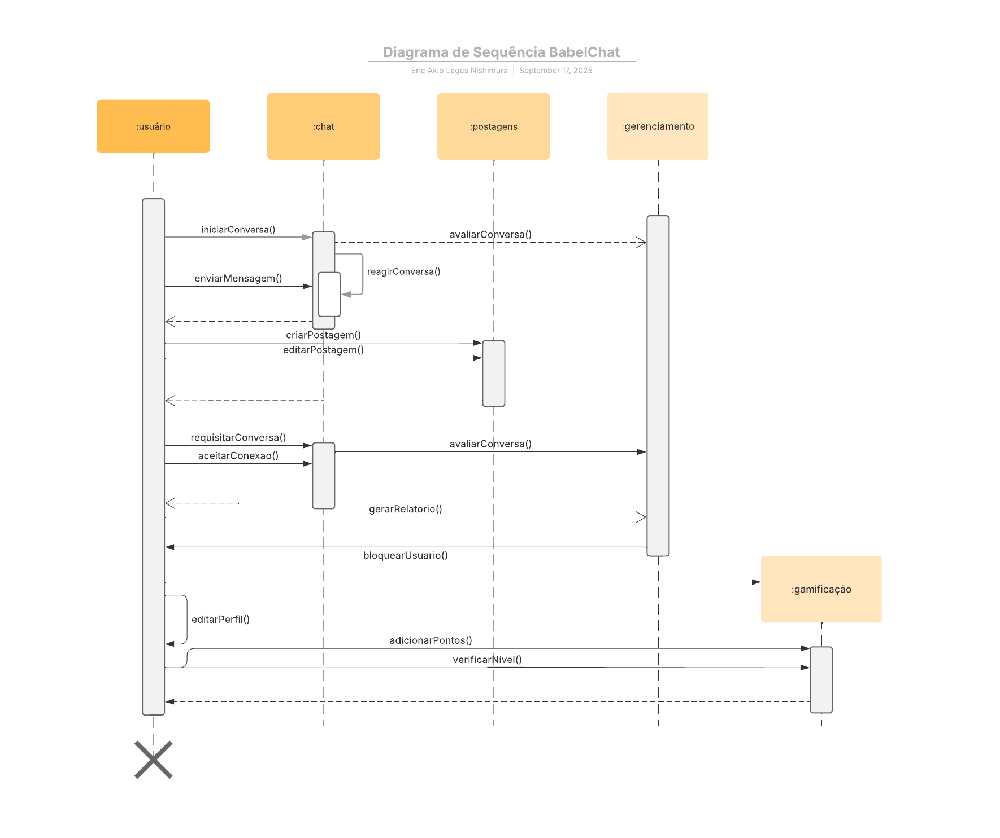

# Diagrama de Sequência

## Introdução

O tipo mais comum de diagrama de interação é o diagrama de sequência, que tem como foco a troca de mensagens entre um determinado número de *lifelines* (objetos/classes e suas ativações). Diagramas de sequência denotam as interações focando na sequência de mensagens trocadas, assim com suas especificações correspondentes.

## Objetivo/Metodologia

Tomando como base o fato desse diagrama ter sido mais um diagrama idealizado pela equipe do UML, sabe-se que esse diagrama segue regras parecidas, além de permitir o entendimento de como as classes dialogam entre si e suas consequências.

Por meio de análise de documentos como o diagrama de classes do sistema, foi construído um diagrama de sequência tendo como base a documentação do UML e como foi apresentado em sala.

## Desenvolvimento (nome do artefato)

**Figura 1:** Diagrama de Sequência

**Autor:** [Eric Akio](https://github.com/eric-kingu)

## Bibliografia

Conjunto de obras consultadas. 

> KIRILL FAKHROUTDINOV. UML sequence diagrams overview of graphical notation - lifeline, message, execution specification, interaction use, etc. Disponível em: <https://www.uml-diagrams.org/sequence-diagrams.html>.

## Histórico de Versões

| Versão |     Data    | Descrição   | Autor(es) | Revisor(es) | Detalhes da revisão | 
| ------ | ----------- | ----------- | --------- | ----------- | --------------------|
| `1.0`  | 17/09/2025  | Criação do documento, criação de um diagrama   |   [Eric Akio](https://github.com/eric-kingu)    |        |        |
