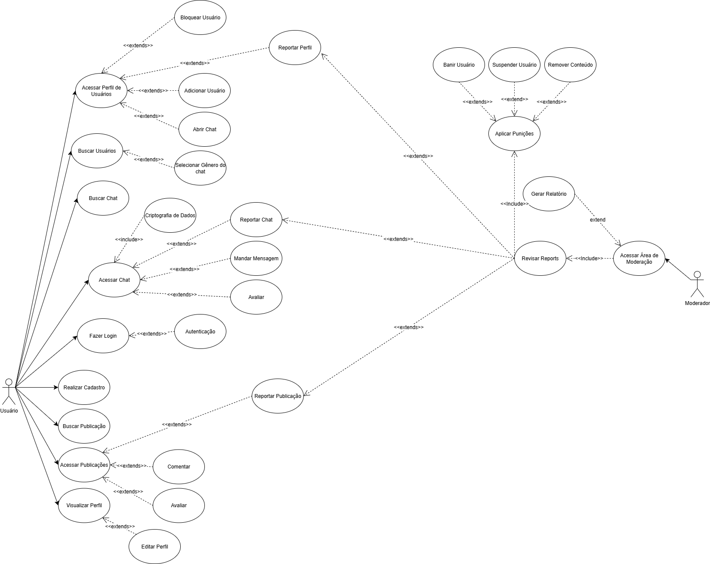

# Diagrama de Casos de Uso – Correio Digital  

## **Introdução**  

Casos de uso são instrumentos fundamentais na modelagem de sistemas, pois representam visualmente os requisitos funcionais e as interações entre os usuários e o sistema. Eles descrevem, de forma estruturada, os objetivos que os atores desejam alcançar ao utilizar o sistema e as sequências de ações necessárias para isso. Essa abordagem facilita a comunicação entre desenvolvedores, analistas e stakeholders, promovendo um entendimento claro das funcionalidades esperadas.  

Neste projeto, o foco recai sobre as ações atribuídas ao **usuário** e ao **moderador** (administrador) no sistema do **Correio Digital**, uma plataforma voltada para o envio, recebimento e gestão de correspondências digitais. O moderador (administrador) desempenha um papel crítico na manutenção e segurança do ambiente, assegurando que os serviços estejam disponíveis, seguros e alinhados às diretrizes estabelecidas. Suas funções incluem monitoramento de atividades suspeitas e controle de punição.  

---

## **Metodologia**  

Para a construção do diagrama de casos de uso, primeiramente foram identificados os principais atores do sistema, a saber: o **usuário** (cidadão ou empresa) e o **moderador** (administrador). Consideraram-se os perfis de uso e as personas previamente definidas, a fim de mapear os casos de uso relevantes que deveriam compor o escopo do **Correio Digital**.  

Na sequência, foram levantadas e organizadas as principais ações que cada tipo de ator pode realizar na aplicação. Entre elas estão: cadastro, autenticação, envio e recebimento de correspondências digitais, organização de mensagens, bem como as funcionalidades específicas do moderador (administrador), como o acesso a área de moderação administração.  

---

## **Diagramas de Casos de Uso**  

### Diagrama Geral: Usuário e Moderador (Administrador)  

  

  
<strong>Figura 1</strong> – Diagrama de casos de uso combinando ações do usuário e do moderador (administrador).  

  

Autores: [João Pedro Costa](https://github.com/johnaopedro), [Julia Gabriela](https://github.com/JuliaGabP)  

---
## Bibliografia  

> SOMMERVILLE, Ian. Engenharia de Software. 10. ed. São Paulo: Pearson, 2019.
> Bóson Treinamentos. Curso de UML - O que são Diagramas de Casos de Uso. YouTube, 2020. Disponível em: https://www.youtube.com/watch?v=K-BaRfFx0mA.

## Histórico de Versões

| Versão |     Data    | Descrição   | Autor(es) | Revisor(es) | Detalhes da revisão | 
| ------ | ----------- | ----------- | --------- | ----------- | --------------------|
| `1.0`  | 20/09/2025  | Criação do documento | [João Pedro Costa](https://github.com/johnaopedro) | - | - |
| `1.1`  | 20/09/2025  | Criação do diagrama | [João Pedro Costa](https://github.com/johnaopedro) e [Julia Gabriela](https://github.com/JuliaGabP) | - | - |
| `1.2`  | 20/09/2025  | Inclusão das informações especificas | [João Pedro Costa](https://github.com/johnaopedro) e [Julia Gabriela](https://github.com/JuliaGabP) | - | - |
| `1.3`  | 22/09/2025  | Revisão geral do documento | [João Pedro Costa](https://github.com/johnaopedro) e [Julia Gabriela](https://github.com/JuliaGabP) | - | - |
