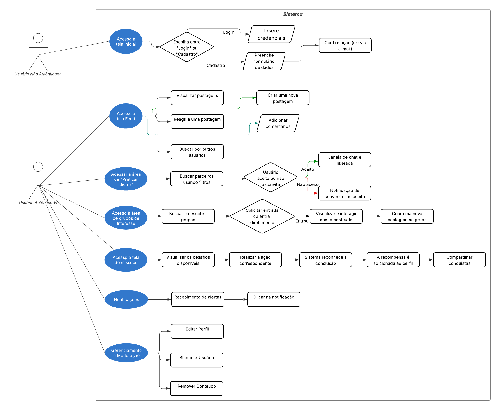

# Diagrama de Usuário — Correio Digital

---

## Introdução

O presente documento apresenta o **Diagrama de Usuário** do sistema *Correio Digital*, com o objetivo de descrever visualmente os principais fluxos percorridos pelos usuários durante a interação com a aplicação. Este artefato contribui para a compreensão coletiva do funcionamento do sistema, auxiliando na validação de requisitos, no planejamento de UI/UX e na comunicação entre equipe de desenvolvimento e stakeholders.

---

## Objetivo

O diagrama de usuário busca:

* Demonstrar os caminhos mais relevantes seguidos pelos diferentes tipos de usuários;
* Ilustrar os pontos de entrada e saída do sistema;
* Representar decisões críticas e ações disponíveis;
* Apoiar o desenvolvimento, testes e a manutenção do projeto.

---

### **Metodologia**

Para a elaboração do diagrama de usuário do *Correio Digital*, foram considerados os seguintes passos:

1.  **Identificação dos Perfis:** Definição dos perfis de usuários existentes no sistema (usuário não autenticado e usuário autenticado).
2.  **Levantamento dos Fluxos:** Mapeamento dos principais fluxos de interação a partir de todas as funcionalidades previstas no projeto.
3.  **Construção do Diagrama:** Utilização de notação padronizada de fluxograma, com símbolos que representam ações, decisões, entradas/saídas e estados.

---

### **Perfis de Usuário**

* **Usuário Não Autenticado:**
    * Acessa a página inicial do aplicativo.
    * Realiza o processo de cadastro para criar uma nova conta.
    * Efetua login para acessar a plataforma.

* **Usuário Autenticado:** Além das ações de um usuário não autenticado, pode:
    * **Interação Social:** Criar, reagir e comentar em postagens no feed principal.
    * **Aprendizado e Comunicação:**
        * Buscar e conversar com outros usuários para praticar idiomas.
        * Participar de grupos com interesses em comum.
    * **Engajamento e Gamificação:**
        * Cumprir missões de aprendizado.
        * Receber premiações e visualizar seu progresso.
    * **Gerenciamento de Conta:**
        * Editar seu perfil.
        * Visualizar notificações sobre interações.
    * **Moderação:**
        * Bloquear outros usuários.
        * Remover conteúdos que postou.

---

### **Fluxos Principais**

**1. Autenticação (Login/Cadastro)**
* Acesso à tela inicial → Escolha entre "Login" ou "Cadastro".
* **Login:** Insere credenciais → Sistema valida → Acesso ao Feed.
* **Cadastro:** Preenche formulário de dados → Confirmação (ex: via e-mail) → Acesso ao Feed.

**2. Interações no Feed**
* Visualizar postagens de outros usuários.
* Criar uma nova postagem (texto, imagem, etc.).
* Reagir a uma postagem existente.
* Adicionar comentários a uma postagem.
* Buscar por outros usuários na plataforma.

**3. Chat e Aprendizado de Idiomas**
* Acessar a área de "Praticar Idioma".
* Buscar parceiros usando filtros (idioma nativo, idioma que está aprendendo).
* Enviar um convite para iniciar uma conversa.
* Após o aceite, a janela de chat é liberada para a troca de mensagens.

**4. Grupos de Interesse**
* Buscar e descobrir grupos por tema.
* Solicitar entrada em grupos privados ou entrar diretamente em grupos públicos.
* Visualizar e interagir com o conteúdo postado dentro de um grupo.
* Criar uma nova postagem direcionada ao grupo.

**5. Gamificação e Recompensas**
* Acessar a tela de "Missões" ou "Progresso".
* Visualizar os desafios disponíveis (ex: "Inicie 3 conversas hoje").
* Realizar a ação correspondente no aplicativo.
* O sistema reconhece a conclusão da missão e notifica o usuário.
* A recompensa (pontos, medalha) é adicionada ao perfil do usuário.
* Usuário pode compartilhar em outro sites suas premiações/conquistas dentro do site.

**6. Notificações**
* Recebimento de alertas sobre eventos (novas reações, comentários, convites de chat, missões cumpridas).
* Clicar na notificação para ser direcionado ao conteúdo relacionado.

**7. Gerenciamento e Moderação**
* **Editar Perfil:** Acessar a página de configurações e alterar informações pessoais.
* **Bloquear Usuário:** Acessar o perfil de outro usuário e selecionar a opção "Bloquear".
* **Remover Conteúdo:** Em uma postagem própria, selecionar a opção para removê-la.

---

## Representação Gráfica

O diagrama presente na figura 1 representa de forma visual os fluxos descritos, utilizando a notação de fluxograma:

* **Oval:** pontos de início e fim.
* **Retângulo:** telas ou ações do sistema.
* **Diamante:** decisões.
* **Paralelogramo:** entrada/saída de dados.

O diagrama inicia no acesso à Home e se ramifica para os diferentes fluxos, como login, cadastro, acesso ao feed e interações, até os fluxos de moderação.

**Figura 1:** Diagrama de Usuário 

**Autoras:** [Esther Sena](https://github.com/esmsena) e [Mariiana Siqueira Neris](https://github.com/Maryyscreuza)

---
## Referências

> UserGuiding. **Diagrama de fluxo do usuário: o que é e como criar um.** Disponível em: [https://userguiding.com/pt-br/blog/diagrama-de-fluxo-do-usuario](https://userguiding.com/pt-br/blog/diagrama-de-fluxo-do-usuario)

## Histórico de Versões

| Versão | Data       | Descrição  | Autor(es) | Revisor(es) | Detalhes  da revisão |
|--------|-----------|-----------------------------|-----------|-------------|----------|
| `1.0`  | 16/09/2025 | Criação inicial do documento com os tópicos iniciais juntamente com Perfis de Usuário, Fluxos Principais e Representação gráfica |[Esther Sena](https://github.com/esmsena) | | |
| `1.1`  | 21/09/2025 | Inserção do diagrama completo com os casos de uso adicionados | [Mariiana Siqueira Neris](https://github.com/Maryyscreuza) | | |
