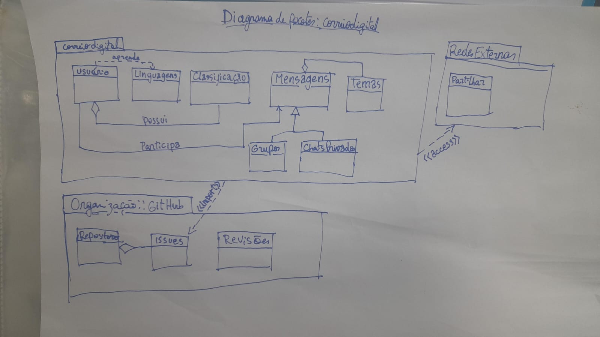

# Diagrama de Pacotes

## Introdução

O diagrama de pacotes é uma ferramenta da UML responsável por descrever como os elementos do modelo estão organizados em divisões lógicas (pacotes) e demonstra as dependências entre eles. É um diagrama útil para separar os módulos, divisões e camadas da arquitetura em um projeto de software. 

## Objetivo/Metodologia

Haja vista que esse diagrama trata-se de uma variação do diagrama de classes, ele permite uma visualização clara do sistema, mas é mais conciso, representando uma visão em módulos. Por meio dele, foi representado elementos como o próprio site, a interface de usuário e os módulos dentro dele, assim como pacotes de segurança e de dados, cada um com suas divisões, módulos internos e dependências.

O diagrama de pacotes foi construído de forma colaborativa, a partir do estudo teórico e do levantamento de requisitos. Os conceitos centrais do sistema foram analisados com apoio de brainstorming e rich pictures, permitindo a definição dos principais módulos e de suas responsabilidades, bem como a organização de suas inter-relações. 

Nesse documento serão apresentados dois diagramas, pois a dupla [Esther Sena](https://github.com/esmsena) e [Mariiana Neris](https://github.com/Maryyscreuza), e o aluno [Eric Akio](https://github.com/eric-kingu) fizeram um diagrama cada. Após isso, foi realizada uma enquete no grupo de Whatsapp que o 
O diagrama de pacotes foi construído de forma colaborativa, a partir do estudo teórico e do levantamento de requisitos. Os conceitos centrais do sistema foram analisados com apoio de brainstorming e rich pictures, permitindo a definição dos principais módulos e de suas responsabilidades, bem como a organização de suas inter-relações. 

Nesse documento serão apresentados dois diagramas, pois a dupla [Esther Sena](https://github.com/esmsena) e [Mariiana Neris](https://github.com/Maryyscreuza), e o aluno [Eric Akio](https://github.com/eric-kingu) fizeram um diagrama cada. Após isso, foi realizada uma enquete no grupo de Whatsapp da organização do grupo para decidir o diagrama que será seguido e o diagrama da dupla foi escolhido.

## Desenvolvimento

**Figura 1:** Diagrama de Pacotes selecionado pelo grupo.

**Autoras:** [Esther Sena](https://github.com/esmsena) e [Mariiana Neris](https://github.com/Maryyscreuza).

**Figura 2:** Diagrama de Pacotes descartado por votação. 

**Autor:** [Eric Akio](https://github.com/eric-kingu).

## Bibliografia

Conjunto de obras consultadas

> UML Package Diagrams: An Agile Introduction. Disponível em: <https://agilemodeling.com/artifacts/packageDiagram.htm>.

‌## Histórico de versão

| Versão | Data | Descrição | Autor(es) | Revisor(es) | Detalhes da revisão |
|--------|------|-----------|-----------|-------------|---------------------|

| `1.0`  | 12/09/2025 | Criação do documento, inserção do diagrama | [Eric Akio](https://github.com/eric-kingu) | [Julia Gabriela](https://github.com/JuliaGabP) | Revisão de ortografia e completude do documento, visto a falta do diagrama que outro integrante desenvolveu |
|| `1.1` | 14/09/2025 | inserção de outro diagrama | [Esther Sena](https://github.com/esmsena) e [Mariiana Neris](https://github.com/Maryyscreuza) |  |  |
